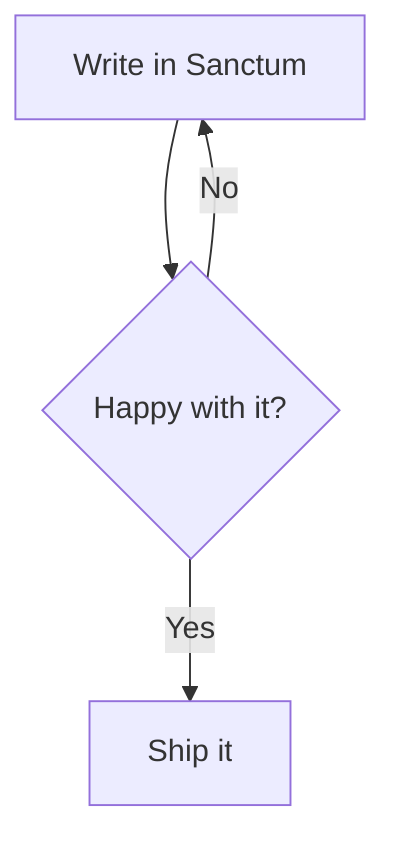

# Sanctum Syntax Guide

Sanctum notes are plain markdown, plus a handful of extra conventions for linking, tagging, and embedding content. Everything on this page is rendered live through the exact same pipeline every note uses — nothing here is a mockup. Every example below shows the raw markdown source first, then how it actually renders.

Raw HTML in a note's source is also passed through as-is (a stray `<br>` or `<sub>text</sub>` works), and bare URLs (`https://example.com` typed with no brackets) auto-link on their own.

> [!NOTE] Smart typography
> Straight quotes, `--`, `---`, and `...` typed in prose are automatically swapped for curly quotes, en/em dashes, and a real ellipsis. If you're pasting text where that substitution isn't wanted (code-like content outside a fence, for instance), keep it inside a fenced or inline code span — that's exempt.

## Basic formatting

```markdown
**Bold**, *italic*, ~~strikethrough~~, `inline code`, and ==highlighted text==.
```

Rendered: **Bold**, *italic*, ~~strikethrough~~, `inline code`, and ==highlighted text== — useful for flagging something to come back to.

A single line break inside a paragraph does *not* start a new line when rendered — leave a blank line between paragraphs, same as standard markdown everywhere else.

### Lists

```markdown
- A bullet list
- With a second item
  - And a nested one

1. A numbered list
2. Second item

- [ ] An unchecked task
- [x] A completed task
```

Rendered:

- A bullet list
- With a second item
  - And a nested one

1. A numbered list
2. Second item

- [ ] An unchecked task
- [x] A completed task

Task checkboxes are click-toggleable directly in Read mode — clicking one saves for real, the same as any other edit.

## Links between notes

Sanctum uses **wikilinks** to connect notes to each other, the same convention Obsidian and Roam use:

```markdown
[[Note Title]]
[[Note Title|custom display text]]
[[Note Title#Heading]]
[[Note Title^block-id]]
```

- `[[Note Title]]` links to a note by its exact title. Resolution tries, in order: an exact case-sensitive match, then case-insensitive, then falls back to the first note whose filename *starts with* that text (a prefix match, not a search for the text anywhere in the name).
- `[[Note Title|display text]]` links the same way but shows different text.
- `[[Note Title#Heading]]` jumps straight to a specific heading in that note.
- `[[Note Title^block-id]]` jumps to a specific paragraph — see [[Block references]] below for how to tag one. A link can target a heading *or* a block id, not both at once.

A link to a note that doesn't exist (yet) still renders — it just does nothing when clicked until you create a note with that title (there's currently no distinct visual style for an unresolved link, so it looks the same either way). These examples aren't shown as live links on this page since they'd point at notes that don't exist in *your* vault specifically. Note titles are matched by filename alone, not by folder — two notes with the same name in different folders can't both be linked to unambiguously.

`#Heading` matches by the heading's own text, lowercased and stripped of punctuation. If a note reuses the exact same heading text twice, only the first one is reachable by `#Heading` — give repeated headings distinct text if you need to link to more than one of them.

## Tags

```markdown
#project #todo #reference
```

Rendered: #project #todo #reference

Tags use a leading `#tag`. They show up automatically in the Tag Browser in the sidebar, and can also live in a note's frontmatter as a `tags:` list.

## Callouts

```markdown
> [!NOTE]
> A plain note callout — the default when you don't specify a type.
```

Rendered:

> [!NOTE]
> A plain note callout — the default when you don't specify a type.

The full syntax is a blockquote starting with `> [!TYPE] Optional Title`, then more `>` lines for the body. Every other type below follows the exact same shape, just with a different `TYPE` and an optional title after it:

```markdown
> [!TIP] Pro tip
> Callouts can have a custom title, like this one.
```

Supported types, and how they render:

> [!TIP] Pro tip
> Callouts can have a custom title, like this one.

> [!WARNING]
> Something to be careful about.

> [!DANGER] Heads up
> Something that could genuinely break if you're not careful.

Full list with a distinct accent color: `NOTE`, `TIP`/`SUCCESS`, `WARNING`/`TODO`, `DANGER`/`IMPORTANT`, `QUESTION`/`EXAMPLE`/`ABSTRACT`. The type word itself isn't actually restricted to this list — `[!ANYTHING]` still renders as a real, working callout box, it just falls back to the same default color `NOTE` uses if it isn't one of the ones above.

## Code blocks

Fenced code blocks (three backticks, optionally followed by a language name) get real syntax highlighting:

````markdown
```typescript
function greet(name: string): string {
  return `Hello, ${name}!`
}
```
````

Rendered:

```typescript
function greet(name: string): string {
  return `Hello, ${name}!`
}
```

Real syntax coloring is available for `bash`, `css`, `javascript`, `json`, `markdown`, `python`, `typescript`, `xml`/`html`, and `yaml` (plus their common aliases, like `sh`, `ts`, `py`, `yml`). A language outside that list — or no language at all — still renders as a code block, just without colored syntax.

## Runnable code

```python and ```javascript fenced blocks are special — each gets a **Run** button and actually executes right in the browser (Python via Pyodide/WebAssembly, JavaScript natively), no server involved:

````markdown
```python
print("hello from Sanctum")
for i in range(3):
    print(i * i)
```
````

Just write the code — the output you'll see below it appears automatically once you click Run, it isn't something you type by hand. Try it:

```python
print("hello from Sanctum")
for i in range(3):
    print(i * i)
```
```python-output
{
  "execNumber": 1,
  "stdout": "hello from Sanctum\n0\n1\n4\n",
  "stderr": "",
  "images": [],
  "errorMessage": null
}
```

JavaScript works exactly the same way — try this one too:

````markdown
```javascript
console.log("hello from Sanctum");
for (let i = 0; i < 3; i++) {
  console.log(i * i);
}
```
````

```javascript
console.log("hello from Sanctum");
for (let i = 0; i < 3; i++) {
  console.log(i * i);
}
```
```javascript-output
{
  "execNumber": 1,
  "stdout": "hello from Sanctum\n0\n1\n4\n",
  "stderr": "",
  "images": [],
  "errorMessage": null
}
```

A first Python run starts a real WASM runtime (~5–10s, one-time per note) — JavaScript has no such delay, since it runs natively. The icon next to Run restarts the kernel, clearing all state for that note. One real difference between the two: Python keeps a variable defined in one cell available to the next (a genuine, reused interpreter, same as a real notebook), while JavaScript gives every run a completely fresh scope — which is also what makes real top-level `await` work cleanly in a JS cell.

Either language's output persists into the note's own markdown the moment a run finishes, so it's still there after closing and reopening the note — not just for the current session.

## Tables

Type `/table` in Edit mode and Sanctum drops in a click-to-edit grid — no hand-aligning pipe characters. Click any cell to edit it, use the `+` buttons to add rows and columns, hover a row or column for its delete button. A table too wide for the page scrolls within itself instead of pushing the rest of the page sideways — drag anywhere in it to pan, or use the expand icon (appears once a table's actually wide enough to need it) for a fullscreen view.

Prefer writing it by hand, or pasting a table copied from somewhere else? Standard GFM pipe syntax works too — Sanctum recognizes it on sight and swaps in the same visual grid automatically, in Edit mode. Read mode (like this page) always renders the plain HTML table underneath either way, hover the one below for its own expand icon:

```markdown
| Feature | Works in Sanctum? |
| --- | --- |
| Wikilinks | Yes |
| Tables | Yes (you're looking at one) |
| Graph view | No — not planned |
```

Rendered:

| Feature | Works in Sanctum? |
| --- | --- |
| Wikilinks | Yes |
| Tables | Yes (you're looking at one) |
| Graph view | No — not planned |

## Math

Type `/math` in Edit mode for a visual equation editor — a proper math-aware input, not raw LaTeX typing. Type command names directly (`sqrt`, `frac`, `alpha`, `sum`, `int`...) and they build the real symbol as you go, the same way a graphing calculator's input works; or paste LaTeX copied from a paper, Wolfram Alpha, or anywhere else and it renders immediately. The expand icon opens a fullscreen view with an on-screen math keyboard, for browsing symbols without knowing their command names.

Inline math works the same way mid-sentence — write `$...$` and it renders live the instant your cursor moves elsewhere, click back into it to edit the raw LaTeX directly.

Both also still accept plain hand-written LaTeX, exactly as before — this page (Read mode) renders it identically either way:

```markdown
Inline math like $E = mc^2$ works via a single `$...$`, and block math gets its own line:

$$
\int_0^\infty e^{-x^2} \, dx = \frac{\sqrt{\pi}}{2}
$$
```

Rendered: inline math like $E = mc^2$ works via a single `$...$`, and block math gets its own line:

$$
\int_0^\infty e^{-x^2} \, dx = \frac{\sqrt{\pi}}{2}
$$

## Footnotes

```markdown
Here's a sentence with a footnote.[^1]

[^1]: And here's the footnote itself, rendered at the bottom of the note.
```

Rendered: here's a sentence with a footnote.[^1]

[^1]: And here's the footnote itself, rendered at the bottom of the note.

## Block references

Any paragraph or list item can become a linkable "block" by tagging the end of its **last line** with a `^block-id`:

```markdown
This is the paragraph you want to reference later. ^my-block-id
```

The id has to trail the actual text on the same line, with a space before it — not sit alone on its own line above the paragraph. Once tagged, `[[Note^my-block-id]]` (a link) or `![[Note^my-block-id]]` (an embed, see below) can target just that one block.

A runnable `python` or `javascript` fence can be tagged the same way, but on its **opening** fence line instead of trailing a paragraph:

````markdown
```python ^intro-imports
import numpy as np
```
````

The space before `^` is required there too — `` ```python^id `` with no space is silently *not* recognized (the whole thing is read as one invalid language name instead, and that block quietly loses both syntax highlighting and its Run button). This tagging currently only works on `python`/`javascript` fences — it doesn't do anything on `mermaid`/`plotly`/`chartjs` fences.

## Embedding content from another note

`![[Note Title]]` embeds an entire other note's content inline, right where you write it — useful for pulling a shared reference into several notes without copy-pasting. It has to sit alone on its own line, not mixed into a sentence. Scoped variants work too:

```markdown
![[Note Title]]
![[Note Title#Heading]]
![[Note Title#Heading1..#Heading2]]
![[Note Title^block-id]]
```

The `#Heading1..#Heading2` form embeds everything from the first heading through the end of whatever the second one covers — handy for pulling in a whole run of sections at once.

`![[Note^my-block-id]]` targeting a tagged `python`/`javascript` fence (see above) embeds just that one runnable cell — code and its last-saved output together, if it's been run. An embedded cell is always shown read-only (no Run button) even though the source note's own copy is fully live; re-run it from the source note if you need fresh output. Embedded content is fetched once and cached for the rest of the session — editing the source note afterward won't update an embed already on screen until you reload.

## Diagrams and charts

Type `/chart`, `/plotly`, or `/mermaid` in Edit mode for a visual editor instead of hand-writing JSON or diagram syntax — a chart type picker (bar/line/pie) plus a label/value data grid for charts, or a node list + connection list for a flowchart, both with a live preview as you edit. This covers the common single-series chart / simple flowchart case; anything more elaborate (multiple data series, a non-flowchart diagram type, custom styling) automatically falls back to the raw fence below instead of the grid — use the Code icon to switch to raw editing directly whenever you want to hand-write something the visual editor can't represent.

Fenced code blocks with the right language render as live diagrams instead of plain code — this is what both the visual editors above and hand-written fences ultimately produce. Unlike `python`/`javascript` fences, these don't support `^block-id` tagging or single-cell embedding — leave that off a `mermaid`/`plotly`/`chartjs` fence's opening line, it won't do anything useful there.

````markdown

````

Rendered live below:


`plotly` and `chartjs` fenced blocks work the same way, each taking that library's own JSON config as the block's content.

````markdown
```chartjs
{
  "type": "bar",
  "data": {
    "labels": ["Mon", "Tue", "Wed"],
    "datasets": [{ "label": "Notes written", "data": [3, 5, 2], "backgroundColor": "#6fa8c9" }]
  }
}
```
````

Rendered live below — the JSON is exactly what gets passed to `new Chart(canvas, config)`, so anything valid in Chart.js's own config docs works here too:

```chartjs
{
  "type": "bar",
  "data": {
    "labels": ["Mon", "Tue", "Wed"],
    "datasets": [{ "label": "Notes written", "data": [3, 5, 2], "backgroundColor": "#6fa8c9" }]
  }
}
```

````markdown
```plotly
{
  "data": [{ "x": [1, 2, 3], "y": [2, 6, 3], "type": "scatter" }],
  "layout": { "title": { "text": "A simple line" } }
}
```
````

Rendered live below — `data` and `layout` map directly onto Plotly's own `Plotly.newPlot(el, data, layout)` call:

```plotly
{
  "data": [{ "x": [1, 2, 3], "y": [2, 6, 3], "type": "scatter" }],
  "layout": { "title": { "text": "A simple line" } }
}
```

## Images and media

```markdown

```

Images use plain markdown syntax and are matched by filename alone anywhere in your vault (not just an `assets` folder specifically) — no need to write a full path, just the filename. YouTube links, audio files, and PDFs work the same `` syntax; Sanctum detects what it's linking to and renders the right kind of embed (video player, audio player, or PDF preview) instead of a broken image icon. A link title in the parentheses (``) isn't supported — leave it off, or the media type detection can miss and it'll fall back to a plain broken image.

## Note properties (frontmatter)

A block of `key: value` pairs at the very top of a note, fenced by `---` lines, becomes that note's structured properties — editable from the Properties panel above a note's content, not as raw text:

```markdown
---
title: My Note
tags: [project, reference]
status: in-progress
---
```

The opening `---` has to be the very first thing in the file — no blank line, no title, nothing above it. If there's no matching closing `---`, none of it is treated as frontmatter at all; it just renders as ordinary note text instead.

## Finding your way around

- **Ctrl+Shift+K** — command palette (quick actions, and a full keyboard shortcuts reference)
- **Ctrl+O** — jump to any note by name
- **Ctrl+Shift+F** — full-text search
- **Ctrl+E** — toggle Read/Edit mode
