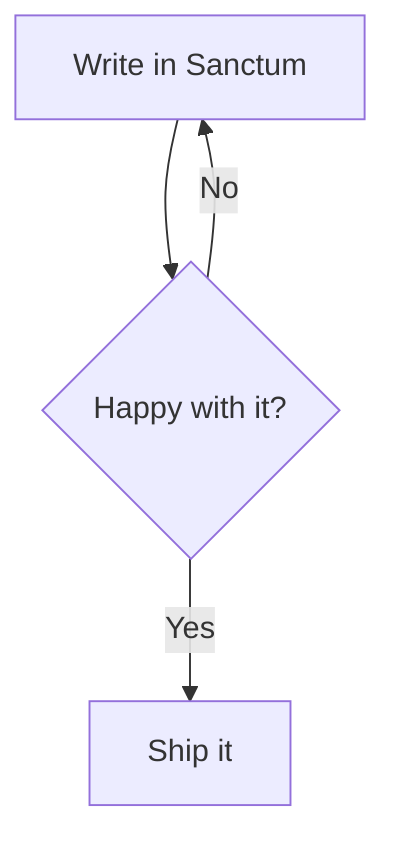

# Sanctum Syntax Guide

Sanctum notes are plain markdown, plus a handful of extra conventions for linking, tagging, and embedding content. Everything on this page is rendered live through the exact same pipeline every note uses — nothing here is a mockup. Every example below shows the raw markdown source first, then how it actually renders.

## Basic formatting

```markdown
**Bold**, *italic*, ~~strikethrough~~, `inline code`, and ==highlighted text==.
```

Rendered: **Bold**, *italic*, ~~strikethrough~~, `inline code`, and ==highlighted text== — useful for flagging something to come back to.

### Lists

```markdown
- A bullet list
- With a second item
  - And a nested one

1. A numbered list
2. Second item

- [ ] An unchecked task
- [x] A completed task
```

Rendered:

- A bullet list
- With a second item
  - And a nested one

1. A numbered list
2. Second item

- [ ] An unchecked task
- [x] A completed task

## Links between notes

Sanctum uses **wikilinks** to connect notes to each other, the same convention Obsidian and Roam use:

```markdown
[[Note Title]]
[[Note Title|custom display text]]
[[Note Title#Heading]]
[[Note Title^block-id]]
```

- `[[Note Title]]` links to a note by its exact title (case-insensitive, and a partial match works too if nothing else matches).
- `[[Note Title|display text]]` links the same way but shows different text.
- `[[Note Title#Heading]]` jumps straight to a specific heading in that note.
- `[[Note Title^block-id]]` jumps to a specific paragraph — see [[Block references]] below for how to tag one.

A link to a note that doesn't exist (yet) still renders, just as an unresolved link — clicking it does nothing until you create a note with that title. These examples aren't shown as live links on this page since they'd point at notes that don't exist in *your* vault specifically.

## Tags

```markdown
#project #todo #reference
```

Rendered: #project #todo #reference

Tags use a leading `#tag`. They show up automatically in the Tag Browser in the sidebar, and can also live in a note's frontmatter as a `tags:` list.

## Callouts

```markdown
> [!NOTE]
> A plain note callout — the default when you don't specify a type.
```

Rendered:

> [!NOTE]
> A plain note callout — the default when you don't specify a type.

The full syntax is a blockquote starting with `> [!TYPE] Optional Title`, then more `>` lines for the body. Every other type below follows the exact same shape, just with a different `TYPE` and an optional title after it:

```markdown
> [!TIP] Pro tip
> Callouts can have a custom title, like this one.
```

Supported types, and how they render:

> [!TIP] Pro tip
> Callouts can have a custom title, like this one.

> [!WARNING]
> Something to be careful about.

> [!DANGER] Heads up
> Something that could genuinely break if you're not careful.

Full list: `NOTE`, `TIP`/`SUCCESS`, `WARNING`/`TODO`, `DANGER`/`IMPORTANT`, `QUESTION`/`EXAMPLE`/`ABSTRACT`.

## Code blocks

Fenced code blocks (three backticks, optionally followed by a language name) get real syntax highlighting:

````markdown
```typescript
function greet(name: string): string {
  return `Hello, ${name}!`
}
```
````

Rendered:

```typescript
function greet(name: string): string {
  return `Hello, ${name}!`
}
```

## Tables

Type `/table` in Edit mode and Sanctum drops in a click-to-edit grid — no hand-aligning pipe characters. Click any cell to edit it, use the `+` buttons to add rows and columns, hover a row or column for its delete button. A table too wide for the page scrolls within itself instead of pushing the rest of the page sideways — drag anywhere in it to pan, or use the expand icon (appears once a table's actually wide enough to need it) for a fullscreen view.

Prefer writing it by hand, or pasting a table copied from somewhere else? Standard GFM pipe syntax works too — Sanctum recognizes it on sight and swaps in the same visual grid automatically, in Edit mode. Read mode (like this page) always renders the plain HTML table underneath either way, hover the one below for its own expand icon:

```markdown
| Feature | Works in Sanctum? |
| --- | --- |
| Wikilinks | Yes |
| Tables | Yes (you're looking at one) |
| Graph view | No — not planned |
```

Rendered:

| Feature | Works in Sanctum? |
| --- | --- |
| Wikilinks | Yes |
| Tables | Yes (you're looking at one) |
| Graph view | No — not planned |

## Math

Type `/math` in Edit mode for a visual equation editor — a proper math-aware input, not raw LaTeX typing. Type command names directly (`sqrt`, `frac`, `alpha`, `sum`, `int`...) and they build the real symbol as you go, the same way a graphing calculator's input works; or paste LaTeX copied from a paper, Wolfram Alpha, or anywhere else and it renders immediately. The expand icon opens a fullscreen view with an on-screen math keyboard, for browsing symbols without knowing their command names.

Inline math works the same way mid-sentence — write `$...$` and it renders live the instant your cursor moves elsewhere, click back into it to edit the raw LaTeX directly.

Both also still accept plain hand-written LaTeX, exactly as before — this page (Read mode) renders it identically either way:

```markdown
Inline math like $E = mc^2$ works via a single `$...$`, and block math gets its own line:

$$
\int_0^\infty e^{-x^2} \, dx = \frac{\sqrt{\pi}}{2}
$$
```

Rendered: inline math like $E = mc^2$ works via a single `$...$`, and block math gets its own line:

$$
\int_0^\infty e^{-x^2} \, dx = \frac{\sqrt{\pi}}{2}
$$

## Footnotes

```markdown
Here's a sentence with a footnote.[^1]

[^1]: And here's the footnote itself, rendered at the bottom of the note.
```

Rendered: here's a sentence with a footnote.[^1]

[^1]: And here's the footnote itself, rendered at the bottom of the note.

## Block references

Any paragraph or list item can become a linkable "block" by tagging the end of its **last line** with a `^block-id`:

```markdown
This is the paragraph you want to reference later. ^my-block-id
```

The id has to trail the actual text on the same line, with a space before it — not sit alone on its own line above the paragraph. Once tagged, `[[Note^my-block-id]]` (a link) or `![[Note^my-block-id]]` (an embed, see below) can target just that one block.

## Embedding content from another note

`![[Note Title]]` embeds an entire other note's content inline, right where you write it — useful for pulling a shared reference into several notes without copy-pasting. Scoped variants work too:

```markdown
![[Note Title]]
![[Note Title#Heading]]
![[Note Title#Heading1..#Heading2]]
![[Note Title^block-id]]
```

The `#Heading1..#Heading2` form embeds everything from the first heading through the end of whatever the second one covers — handy for pulling in a whole run of sections at once.

## Diagrams and charts

Fenced code blocks with the right language render as live diagrams instead of plain code:

````markdown

````

Rendered live below:


`plotly` and `chartjs` fenced blocks work the same way, each taking that library's own JSON config as the block's content.

````markdown
```chartjs
{
  "type": "bar",
  "data": {
    "labels": ["Mon", "Tue", "Wed"],
    "datasets": [{ "label": "Notes written", "data": [3, 5, 2], "backgroundColor": "#6fa8c9" }]
  }
}
```
````

Rendered live below — the JSON is exactly what gets passed to `new Chart(canvas, config)`, so anything valid in Chart.js's own config docs works here too:

```chartjs
{
  "type": "bar",
  "data": {
    "labels": ["Mon", "Tue", "Wed"],
    "datasets": [{ "label": "Notes written", "data": [3, 5, 2], "backgroundColor": "#6fa8c9" }]
  }
}
```

````markdown
```plotly
{
  "data": [{ "x": [1, 2, 3], "y": [2, 6, 3], "type": "scatter" }],
  "layout": { "title": { "text": "A simple line" } }
}
```
````

Rendered live below — `data` and `layout` map directly onto Plotly's own `Plotly.newPlot(el, data, layout)` call:

```plotly
{
  "data": [{ "x": [1, 2, 3], "y": [2, 6, 3], "type": "scatter" }],
  "layout": { "title": { "text": "A simple line" } }
}
```

## Images and media

```markdown

```

Images use plain markdown syntax, resolved against your vault's `assets` folder automatically, no need to write a full path. YouTube links, audio files, and PDFs work the same `` syntax; Sanctum detects what it's linking to and renders the right kind of embed (video player, audio player, or PDF preview) instead of a broken image icon.

## Note properties (frontmatter)

A block of `key: value` pairs at the very top of a note, fenced by `---` lines, becomes that note's structured properties — editable from the Properties panel above a note's content, not as raw text:

```markdown
---
title: My Note
tags: [project, reference]
status: in-progress
---
```

## Finding your way around

- **Ctrl+Shift+K** — command palette (quick actions, and a full keyboard shortcuts reference)
- **Ctrl+O** — jump to any note by name
- **Ctrl+Shift+F** — full-text search
- **Ctrl+E** — toggle Read/Edit mode
